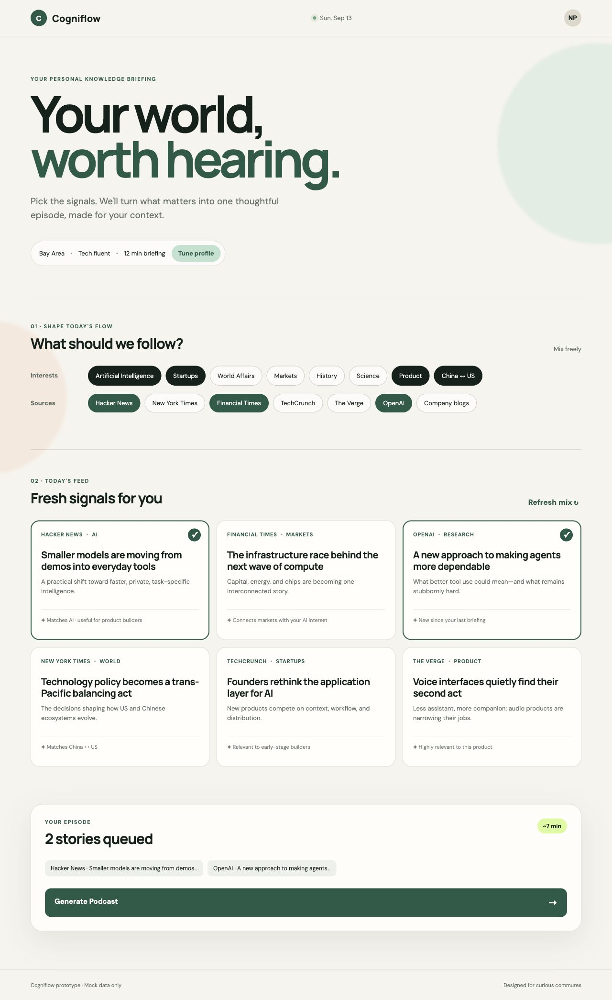

# Cogniflow

**Cogniflow** is an AI-powered knowledge companion that turns the information a person cares about into a personalized daily audio briefing.

The product is designed for moments when people cannot or do not want to look at a screen—commuting, driving, walking, exercising, or doing chores. Instead of asking users to browse through endless feeds and podcasts, it learns their interests, context, and existing knowledge, then helps them continuously absorb useful new ideas.

## How it works

Users begin by setting a lightweight profile:

- Age range and region
- Interests and topics they want to follow
- Current knowledge level
- Preferred episode length

They can then combine topics and information sources such as:

- AI, startups, technology, markets, history, and science
- Hacker News, The New York Times, financial publications, and company blogs
- OpenAI news, major-company updates, and China–US model developments

Each day, the product presents a small set of relevant stories. The user selects what they want to understand and clicks **Generate Podcast**. AI filters repetition, connects related ideas, adds useful context, and organizes the selection into a coherent personal audio episode.

## MVP

The first MVP focuses on demonstrating the complete product experience:

1. Set a personal profile and knowledge level.
2. Select interests, tags, and preferred sources.
3. Browse a personalized daily feed.
4. Add several stories to an episode queue.
5. Generate a structured personal briefing.
6. Listen through a simple podcast player.
7. Review an episode summary and chapters.

The current demo uses mock stories and simulated generation. It does not call paid APIs or collect personal data.

## Demo



Open `index.html` directly in a modern browser. No installation or build step is required.

This prototype is intended to answer one question: **can AI turn a person's information interests into a daily audio experience that genuinely improves how they understand the world?**

## Episode generator (early prototype)

The Python command-line prototype selects AI/MLE items, writes a source-linked script and episode metadata, and can create a short audio file on macOS. The optional AI writing step uses an OpenAI API key stored locally in `.env` (never commit this file).

```bash
python3 episode_generator.py --out episode-output
python3 episode_generator.py --live-hn --live-papers --tts --out episode-output
python3 episode_generator.py --live-hn --live-papers --live-only --ai --tts --out episode-output
```

The output contains `episode.json` (chapters, reasons, and source links) and `episode.txt` (spoken script). With `--tts`, macOS `say` also creates `episode.aiff`. Edit `examples/profile.json` to change interests or `examples/stories.json` to add manually reviewed links. Live fetches need internet access; if a source is unavailable, the command falls back to the sample inputs.

Without `--ai`, this is a simple, no-cost template-based pipeline. With `--ai`, one low-cost model call creates a structured episode from retrieved headlines and summaries. It does **not** browse or read full articles; headline-only stories are explicitly qualified. Review the script against the linked sources before sharing it. The next improvement is a source-reading and fact-checking stage that can support more substantial commentary.

## Local web MVP

Run `python3 web_server.py`, then open `http://127.0.0.1:8765` in a browser. Select Hacker News and/or Hugging Face Daily Papers, refresh the live feed, choose up to five items, choose Luna (lower cost) or Terra (deeper synthesis), then generate a source-linked report. The browser can read the report aloud using its built-in voice. The OpenAI key stays in the local, ignored `.env` file; each click on **Generate report** makes one paid API request. This local server is not intended for public deployment.
