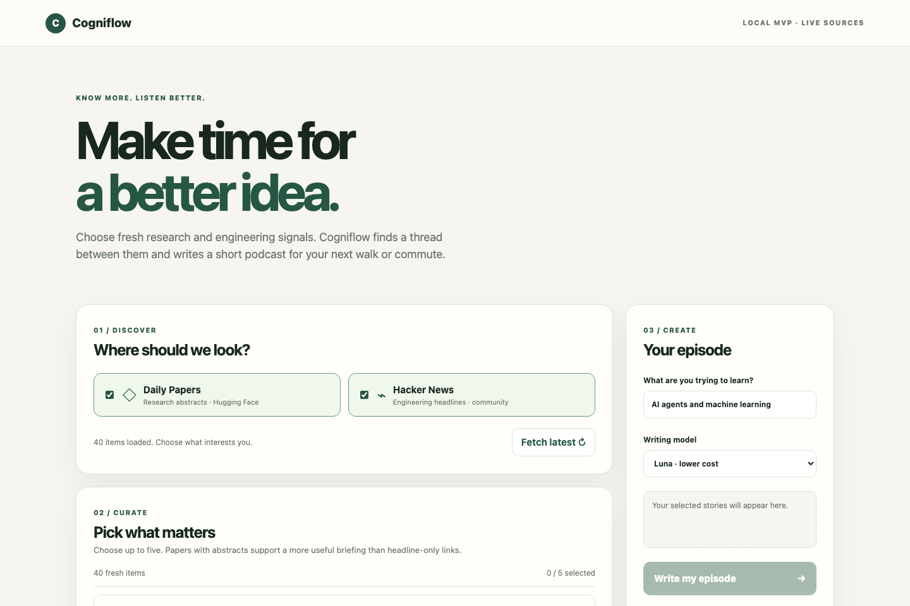

# Cogniflow

Cogniflow turns information you want to follow into a short, personal podcast for a walk, commute, or other screen-free moment. The goal is not to read a feed aloud: it is to connect fresh ideas, explain why they matter, and help listeners build a better understanding over time.

## Current MVP

The local web app lets you:

1. Fetch recent items from **Hugging Face Daily Papers** and **Hacker News**.
2. Choose up to five items and enter a learning focus.
3. Select a writing model and generate one conversational episode with a shared theme and natural transitions.
4. Check the original source links separately from the spoken script.
5. Create, play, and download an MP3 using macOS `say` and `ffmpeg`.

The writing step uses the prompt in [`prompts/podcast_v1.txt`](prompts/podcast_v1.txt). It aims for a listenable narrative rather than a sequence of article summaries. This is an early prototype: it reads titles and available abstracts, **not full articles**, and the resulting claims should be checked against the linked sources. The Mac voice is a convenient audio baseline, not the intended final TTS quality.



## Try it locally

Add your OpenAI API key to a local `.env` file (which is ignored by Git):

```text
OPENAI_API_KEY=your_key_here
```

Then run:

```bash
python3 web_server.py
```

Open <http://127.0.0.1:8765/>. **Write my episode** makes one paid model request; **Create MP3 with Mac voice** runs locally and makes no additional model request. The server is for local use, not public deployment.

You can also generate an episode from the command line:

```bash
python3 episode_generator.py --live-hn --live-papers --live-only --ai --tts --out episode-output
```

The command writes `episode.txt` and `episode.json`; audio options are documented with `python3 episode_generator.py --help`. The earlier [`index.html`](index.html) is a separate, mock-data product-overview prototype, not the live MVP.
